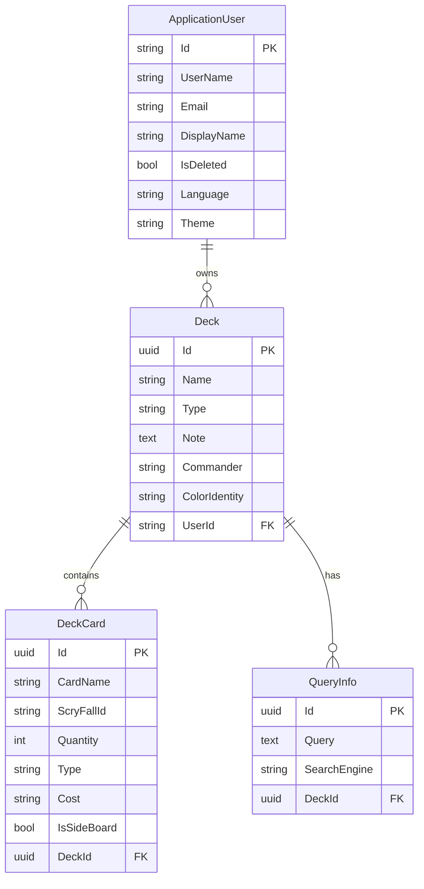

# Database Schema

PostgreSQL database managed via EF Core 10. Authentication uses ASP.NET Identity (`ApplicationUser` extends `IdentityUser`). Custom domain data is organized around 3 entities: `Deck`, `DeckCard`, and `QueryInfo`.

## ERD

## Entities

### ApplicationUser
Extends ASP.NET `IdentityUser` (standard fields: `UserName`, `Email`, `PasswordHash`, etc.).

| Column | Type | Constraints | Notes |
|--------|------|-------------|-------|
| Id | string | PK | Inherited from IdentityUser |
| DisplayName | varchar | nullable | User display name |
| IsDeleted | bool | not null, default false | Soft delete flag |
| Language | varchar | nullable | UI language preference |
| Theme | varchar | nullable | UI theme preference |

---

### Deck

| Column | Type | Constraints | Notes |
|--------|------|-------------|-------|
| Id | uuid | PK | |
| Name | varchar(150) | not null | |
| Type | varchar(80) | not null | Deck format (e.g. Commander, Standard) |
| Note | text | nullable | Free-text notes |
| Commander | varchar(200) | nullable | Commander card name |
| ColorIdentity | varchar(6) | nullable | WUBRG color string |
| UserId | varchar | FK → ApplicationUser, not null | Cascade delete |

---

### DeckCard

| Column | Type | Constraints | Notes |
|--------|------|-------------|-------|
| Id | uuid | PK | |
| CardName | varchar(200) | not null | |
| ScryFallId | varchar(100) | not null | External Scryfall card ID |
| Quantity | int | not null | Number of copies in deck |
| Type | varchar(80) | not null | Card type line |
| Cost | varchar(50) | nullable | Mana cost string |
| IsSideBoard | bool | not null, default false | true = sideboard card |
| DeckId | uuid | FK → Deck, not null | Cascade delete |

---

### QueryInfo

| Column | Type | Constraints | Notes |
|--------|------|-------------|-------|
| Id | uuid | PK | |
| Query | text | not null | Search query text |
| SearchEngine | varchar(80) | not null | Source (e.g. "Scryfall") |
| DeckId | uuid | FK → Deck, not null | Cascade delete |

---

## Relationships & Cascade Rules

- `ApplicationUser` → `Deck`: one-to-many. Deleting a user cascades to all their decks.
- `Deck` → `DeckCard`: one-to-many. Deleting a deck cascades to all its cards.
- `Deck` → `QueryInfo`: one-to-many. Deleting a deck cascades to all its search queries.
